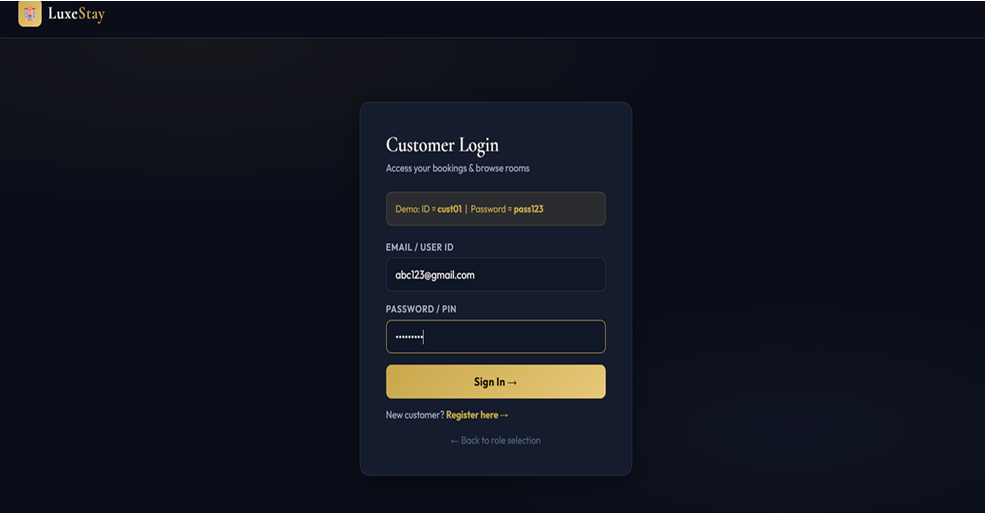
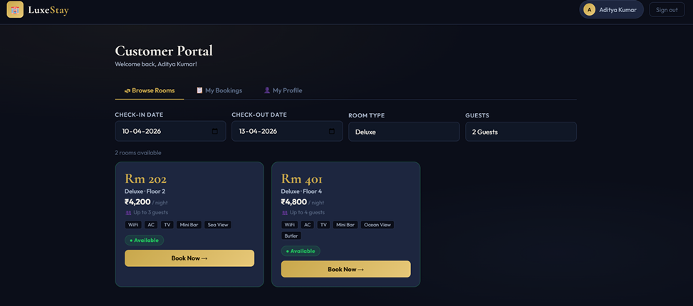
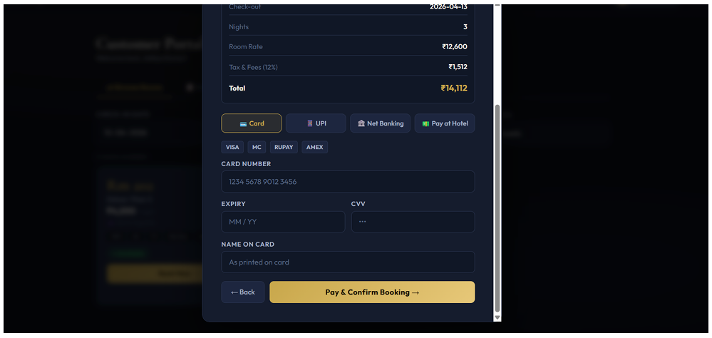

# Hotel Room Booking System

## Overview

Hotel Room Booking System is a full-stack web application that allows customers to browse available rooms, make reservations, and manage bookings. The platform supports role-based access for customers, staff, and administrators, with all booking information stored in a MySQL database.

## Features

- Customer registration and login
- Staff and administrator authentication
- Role-based access control
- Room browsing and availability checking
- Room reservation and booking management
- Booking confirmation system
- Input validation and error handling
- MySQL database integration

## Screenshots

### Login Page



### Room Booking Portal



### Booking Confirmation



## Technologies Used

### Frontend

- HTML
- CSS
- JavaScript

### Backend

- Node.js
- Express.js

### Database

- MySQL

### Version Control

- Git
- GitHub

## Project Structure

```text
public/
├── index.html
├── style.css
└── app.js

db.js
server.js
hotel_booking.sql
package.json
package-lock.json
README.md
```

## Database

The application uses MySQL to manage:

- Customer information
- Staff information
- Administrator information
- Room details
- Reservation records
- Booking information

## Setup Instructions

### Clone Repository

```bash
git clone <repository-url>
```

### Install Dependencies

```bash
npm install
```

### Configure Environment Variables

Create a `.env` file and configure the required database credentials.

### Start the Server

```bash
npm start
```

### Open the Application

Visit:

```text
http://localhost:5000
```

## Key Functionalities

### Customer Module

- Register account
- Login securely
- Browse available rooms
- Make reservations
- View booking details

### Staff Module

- Access reservation information
- Manage booking requests

### Administrator Module

- Manage room information
- Monitor reservations
- Manage system records

## Future Enhancements

- Online payment integration
- Email notifications
- Booking history dashboard
- Advanced search and filtering
- Cloud deployment

## Author

**Harinmayi Parripati**
